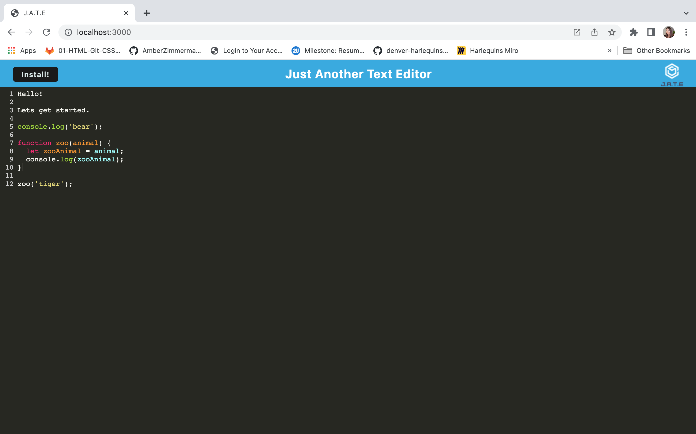
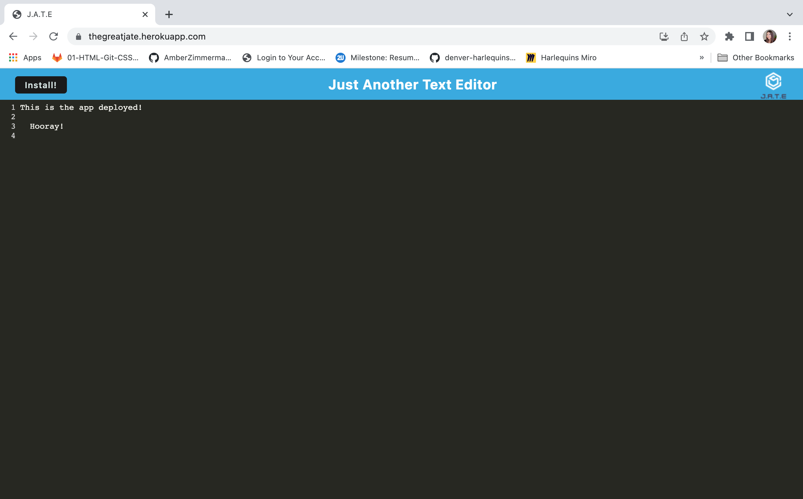
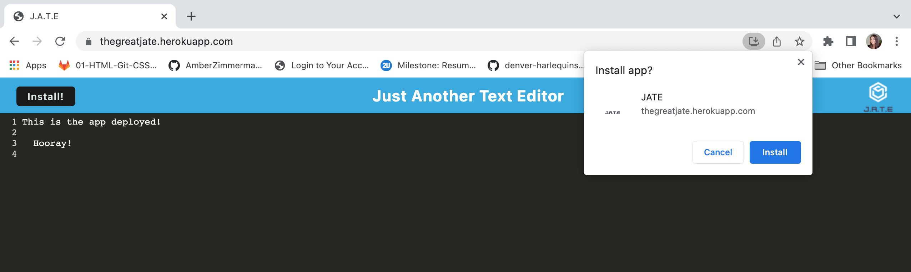
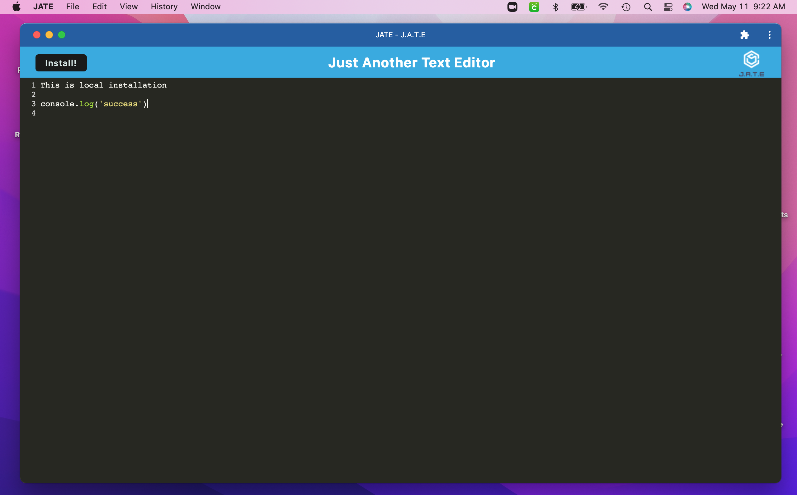

# The Great Jate (text-editor)

### License:

### License Description:

[Click here for the most current description of this license](https://opensource.org/licenses/MIT)

### Link to deployed project:

https://thegreatjate.herokuapp.com/

## Table of Contents:

- [Description](#description)
- [Installation](#installation)
- [License](#license)
- [Questions](#questions)
- [Screenshots](#screenshot)

### Description of the project:

A standard text editor application with a generated manifest.json using the WebpackPwaManifest plug-in. Has the ability to be installed as a progressive web application. Words will appear in different colors to help differentiate code. The user is able to use this application offline or install it onto their machine. Installation will also generate a desktop icon.

### Installation:

In order to install the necessary dependencies, open the console and run the following:
`npm i, npm start`

### Questions:

If you have any questions contact me on [GitHub](https://github.com/AmberZimmerman)

### Screenshot:

Local Deploy:

Heroku Deploy:

Installation prompt that appears after clicking install:

Installed and open on desktop:

